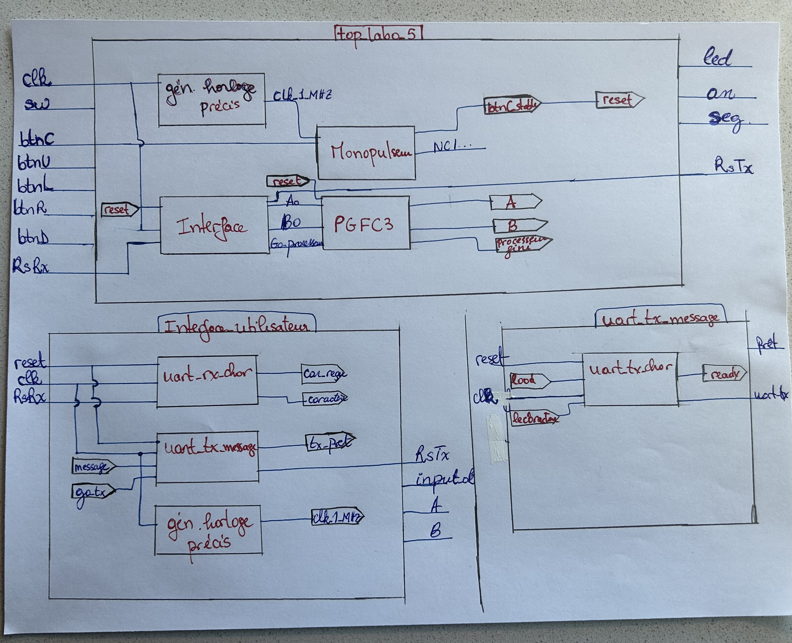

------------------------------------------------------------------------

# INF3500 - labo 5 - hiver 2024

Membre #1 : Alcindor, Marc Jodel, 2000081

Membre #2 : Menouar, Anis, 2247873

------------------------------------------------------------------------

## Partie 1

### Diagramme de blocs du système

Voici notre diagramme :



### Description des modules

Voici, en un paragraphe pour chacun, le rôle et le fonctionnement de chacun des modules :


- generateur_horloge_precis:
Ce module génère un signal d'horloge plus précis et plus stable que celui donné en entrée. Toutefois, on remarque que la fréquence de sortie doit rester inférieure ou égale à la moitié de la fréquence d'entrée, sans quoi un avertissement est généré par le systeme.


- monopulseur: 
Il s'agit d'un module qui permet de filter le signal d'entrée d'un bouton et ainsi éviter des 
oscillations indésirables. Ce module prend en paramètre le signal d'horloge et celui du bouton et produit deux sorties distinctes: une impulsion lorsque le bouton est activé et une autre lorsque celui-ci est relâché. On peut remarquer qu'il possède aussi un double tampon pour réduire les risques de métastabilité.


- uart_rx_char:
Ce module est responsable de la réception des caractères selon le protocole de communication UART. Il prend en entrée un signal de réinitialisation, un signal d'horloge, et un flux de bits (8 bits de données représentant la valeur ASCII du caractère en binaire, avec 1 bit de départ et 1 bit de stop). Il traite les bits et convertit la valeur reçue en un caractère UART. Ensuite, il assigne ce caractère au signal de sortie. Un autre signal de sortie indique enfin que le caractère a été correctement reçu.


- uart_tx_char:
Ce module gère la transmission de caractères. Il prend en entrée un signal de réinitialisation, un signal d'horloge (utilisé pour définir le baud rate), un signal de démarrage de transmission et le caractère à transmettre. Il convertit le caractère en sa valeur équivalente en ASCII sur 8 bits et le transmet un par un avec le bon baud rate, en incluant les bits de départ et de fin.
 

- uart_tx_message:
Ce module gere la transmission d'un message complet en utilisant le module `` uart_tx_char`` pour chaque caractère, avec un taux de transmission bien defini. Il reçoit en entrée un signal de réinitialisation, le signal d'horloge, le message à transmettre et un signal de demande de transmission. En sortie, il genere le signal de transmission et un signal pour indiquer que le le prochain message est pres a etre transmis.


- interface_utilisateur:
L'interface regroupe l'ensemble des modules de communication UART (`uart_tx_message`,`uart_tx_char`, `uart_rx_char` ), avec l'ajout d'un générateur d'horloge précis pour synchroniser les communications. Il prend en entrée un signal de réinitialisation, le signal d'horloge et le signal de réception, et genere en sortie le signal de transmission, les signaux A et B sont utilisés pour d'autres modules externes (PGFC, ...) et un signal permettant de valider la reception des entrees des utilisateurs. Cette interface gère egalement les états des affichages de messages à l'utilisateur (Le message de bienvenue, de nombre invalide ...).
L'affichage et la réception d'entrées des utilisateurs est geree via PuTTY qui permet une connection par RS-232 avec le FPGA.


### Analyse de quelques lignes de code

Voici notre analyse des lignes de code VHDL suivantes.

```
signal c1, c2 : character;
signal r1, r2 : std_logic_vector(7 downto 0);
...
r1 <= std_logic_vector(to_unsigned(character'pos(c1), 8));
c2 <= character'val(to_integer(unsigned(r2)));
```
D'apres notre comprehension du laboratoire, "character" semble être un tableau de integers renvoyant à un caractère (un tableau ASCII).

En ce qui à trait à l'assignation vers le signal r1, il s'agit d'une conversion de caractère ASCII vers un chiffre à 8 bits sous forme de vecteur. 
"character'pos(c1)" cherche la valeur hexadécimale de la valeur ASCII du caractère "c1". Ensuite, cette valeur est convertie en unsigned puis on en vecteur de 8 bits qui correspond au format utilisé par le protocole UART. 


Pour l'assignation vers le signal c2, on essait plutot de faire l'inverse. En effet, "to_integer(unsigned(r2))" convertit la valeur représentée par un vecteur de 8 bits vers un unsigned et, successivement, vers un "integer". Cette conversion est nécessaire pour la passer dans "character'val()" qui retourne le caractère assigné à l'integer en question dans la table ASCII.

La définition de la fonction `character_to_hex()` se trouve dans ce segment: "character'pos(c1)".
Comme expliqué précedemment, ce morceau de code va chercher la valeur hexadécimale ASCII du caractère en question.


## Partie 2

On a remplacé le module qui calcule le plus grand facteur (PGFC) commun par le module de la racine carrée

Voici les modifications que nous avons apportées aux fichiers.

    
- racine_carree.vhd
    - Nous avons utilisé notre code du laboratoire4. 
    - ce module a besoin d'un module qui implémente la division. Nous avons donc ajouté le fichier division_par_reciproque.vhd

- top_labo_5.vhd
    - Nous avons enlevé l'appel au module PGFC.
    - Nous avons ensuite ajouté l'appel du module de la racine_carree.
    - Pour finir, nous avons modifié des signaux d'entrée et de sortie.

- interface_utilisateur.vhd
    - Nous avons modifié des entrées et des sorties.
    -  Nous avons modifié des messages.
    -  Nous avons enlevé l'état 's_n2_m' car il n'est plus nécessaire.


## Partie 3 : Bonus

*Faire un choix et garder seulement une option.*
- Nous sommes vraiment en avance dans nos études, dans ce cours et tous les autres, et nous adorons les défis dans ce cours, donc nous avons complété une ou plusieurs parties du bonus.

### Partie 3a
"Dans un premier temps, nous vérifions après chaque entrée si le caractère se situe entre '0' et '9' ou entre 'A' et 'F' à l'aide de la méthode "character'pos(caractere)", comme nous l'avons expliqué précédemment. Si le caractère se situe en dehors de ces intervalles, nous passons à l'état 's_erreur' et générons un message d'erreur (m9). Ensuite, nous retournons à l'état 's_n1_m' pour recevoir une nouvelle séquence de caractères.

### Partie 3b

Notre approche consiste à vérifier si le signal d'entrée 'fini'==1 lorsque nous sommes dans l'état 'affiche_res'. Nous utilisons ce signal pour déterminer si les calculs effectués dans le module de la racine carrée sont terminés ou non. Si c'est le cas, nous affichons le résultat retourné par le module de la racine carrée, qui est passé en entrée au module interface_utilisateur.vhd. Dans ce cas, nous utilisons la méthode 'hex_to_character'.

## Commentaires

Après avoir déjà réalisé le projet intégrateur 1, dans lequel nous avons expérimenté la communication UART, nous avons une fois de plus confirmé que l'utilisation d'une interface homme-machine est nécessaire pour simplifier le processus de communication (en l'occurrence, une communication via UART) entre deux dispositifs.

Cependant, nous avons dû détecter par nous-mêmes la source de nos erreurs, car nous nous sommes rendu compte que le simple fait que le code compilait ne garantissait pas nécessairement que l'implémentation était optimale ou correcte. La conception de notre diagramme dans la partie 1, nous a vraiment aide a comprendre le systeme.


